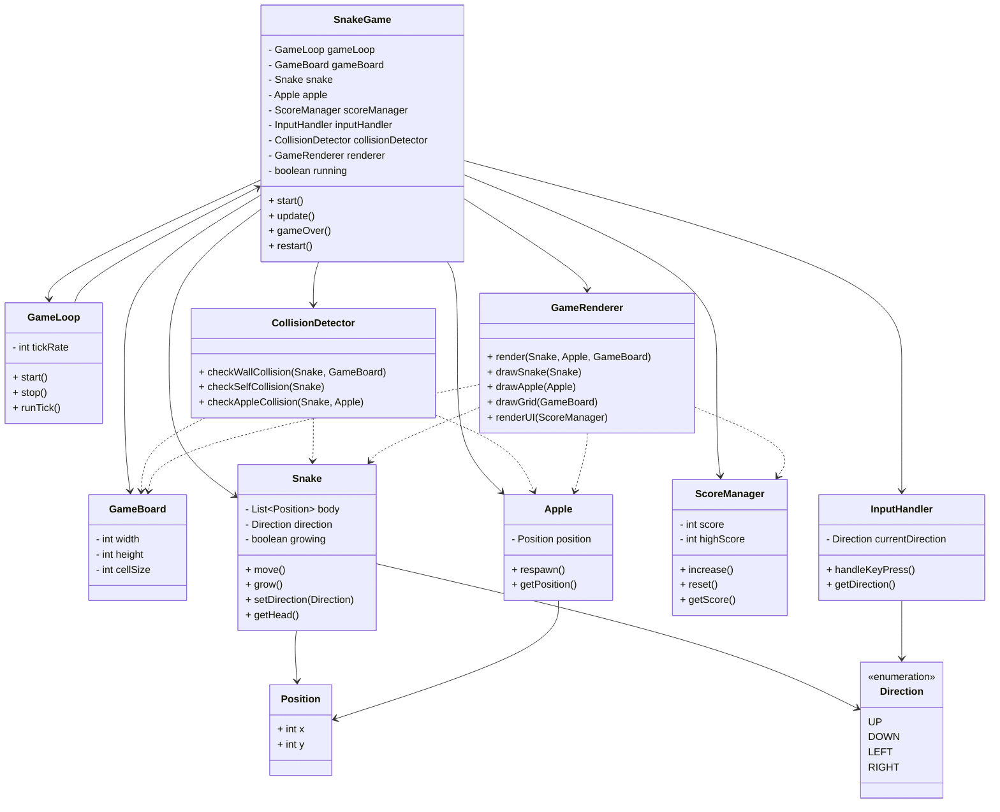

# Snake_the_game
A old school title 

## Snake Mechanics

The core gameplay is based on the classic Snake concept: the player controls a growing snake that moves across the game board, collects apples, and tries to survive as long as possible.

## Game Flow
The snake starts with an initial length and continuously moves in one direction.
The player can change the movement direction using arrow keys (or WASD).
An apple is randomly spawned on the grid.
When the snake eats an apple:
the apple is consumed,
the score increases,
the snake grows by one segment,
a new apple is generated at a free position.
The game continues until a collision occurs.
Movement
The snake moves in fixed time intervals (game loop ticks).
On each tick, a new head segment is added in the current direction.
The last segment is removed to maintain the same length.
When an apple is eaten, the tail segment is not removed, causing the snake to grow.

## Collision System

The game ends when one of the following occurs:

- Wall Collision: The snake’s head hits the boundary of the game board.

- Self Collision: The snake’s head collides with any part of its own body.

## Scoring System
Each apple increases the score by a fixed amount.
The current score is displayed during gameplay.
Optionally, a high score can be stored.
Restart

After a game over, the game can be restarted:

The snake is reset to its initial size.
The score is reset to 0.
A new apple is generated.
The game loop starts again.
Technical Implementation
Movement is handled using a continuous game loop.
Keyboard input is processed via JavaFX event handling.
Collision checks are performed on every update cycle.
Rendering is done using JavaFX graphics components and animations.
Goal of the Game

Collect as many apples as possible, grow your snake, and achieve the highest score without colliding with the walls or your own body.

